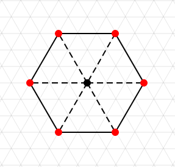
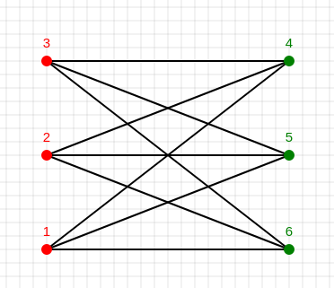
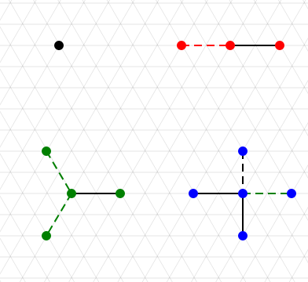

# Canvas-tool
Showcasing the possibilities of HTML5 canvas with a small graph drawing tool. WIP, so expect bugs.

##  Currently supported:
- Drawing vertices and edges freehand or on a grid
- Labeling 
- Coloring
- Different styles (full line or dashed, circular or square, ...)
- Basic operations: delete, move, add...
- Export to JSON for use in research

TODO:
- Tikz export
- Make it prettier

## Showcase

